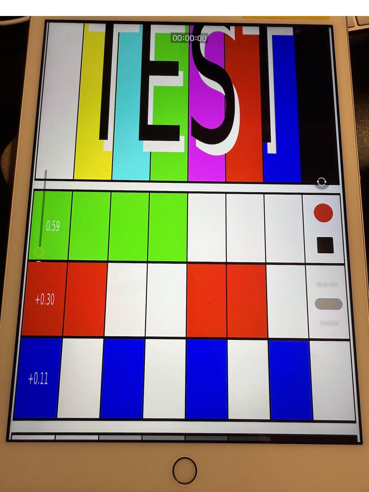
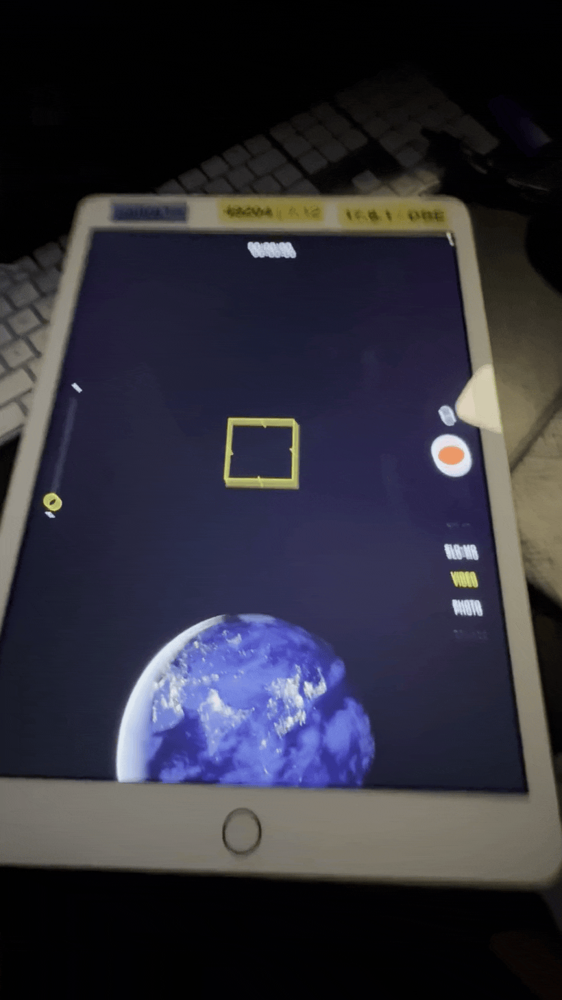

VirtualCamera tweak. Replaces the camera's image/video output with an arbitrary image or video file. Tested on iOS 15 - 17

This works by hooking into `mediaserverd`, which is responsible for, among other things, connecting to the camera hardware and forwarding image data to interested clients (such as user-installed apps). VCam works in apps even if they don't have tweak injection

This is POC stage. The filepath to the "replacement media" is hardcoded in `image_utils.m`. Memory leaks kill `mediaserverd` every 30s

**image file** 
---

**video file**
---

